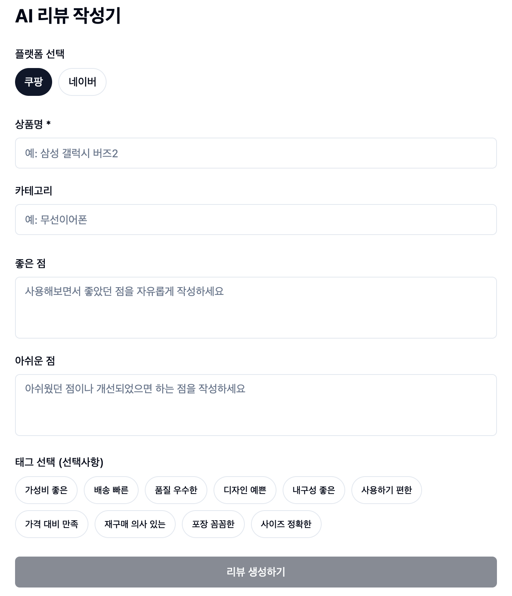

# Review AI

쇼핑몰 리뷰 작성을 도와주는 AI 서비스입니다.
상품 정보와 경험을 입력하면 플랫폼 스타일에 맞는 완성도 높은 리뷰를 생성합니다.

**[→ 서비스 바로가기](https://review-ai-lac.vercel.app/)**



## 만든 이유

AI로 리뷰를 작성할 때마다 플랫폼, 카테고리, 좋은 점, 아쉬운 점을 매번 일일이 정리해서 입력하는 번거로움이 있었습니다.
"리뷰를 어떻게 써야 하지?" 고민하는 주변인들과 함께 쓸 수 있는 도구를 만들고자 기획했습니다.
쇼핑몰마다 선호하는 리뷰 스타일이 다르기 때문에, 플랫폼별 프롬프트를 직접 설계해 입력 정보만 채우면 바로 활용할 수 있도록 했습니다.

## 주요 기능

- **플랫폼별 맞춤 리뷰** — 쿠팡, 네이버 등 플랫폼별 작성 스타일 자동 적용
- **Google Search 연동** — 제품 특징을 검색해 실제 사용 경험처럼 자연스럽게 보완
- **태그 기반 입력** — 가성비, 배송, 품질 등 태그로 빠르게 특징 선택
- **리뷰 히스토리** — 생성한 리뷰를 로컬에 저장하고 불러와 재사용
- **모델 폴백** — Gemini 2.5 Flash 할당량 초과 시 자동으로 대체 모델 전환

## 기술 스택

- **Frontend** — Next.js 14, React 18, TypeScript, Tailwind CSS, shadcn/ui
- **AI** — Google Gemini API (gemini-2.5-flash, gemini-2.5-flash-lite)
- **State** — 로컬 상태 관리 + localStorage 히스토리 저장

## 시작하기

```bash
# 패키지 설치
npm install

# 개발 서버 실행
npm run dev
```

> **환경 변수 설정**: 프로젝트 루트에 `.env.local` 파일을 생성하고 아래 내용을 추가하세요.
>
> ```
> GEMINI_API_KEY=your_api_key_here
> ```

## 환경 변수

| 변수명 | 설명 |
|--------|------|
| `GEMINI_API_KEY` | Google AI Studio API 키 |

## 프로젝트 구조

```
app/
  api/generate-review/  # AI 리뷰 생성 API 라우트
  page.tsx              # 메인 페이지
components/
  PlatformSelector      # 플랫폼 선택
  ProductForm           # 상품 정보 입력
  ReviewInput           # 좋은 점 / 아쉬운 점
  TagSelector           # 태그 선택
  ReviewResult          # 생성된 리뷰 출력 및 복사
  ReviewHistory         # 히스토리 목록
lib/
  gemini.ts             # Gemini 클라이언트
  prompt-builder.ts     # 플랫폼별 프롬프트 생성
  review-history.ts     # localStorage 히스토리 관리
```
